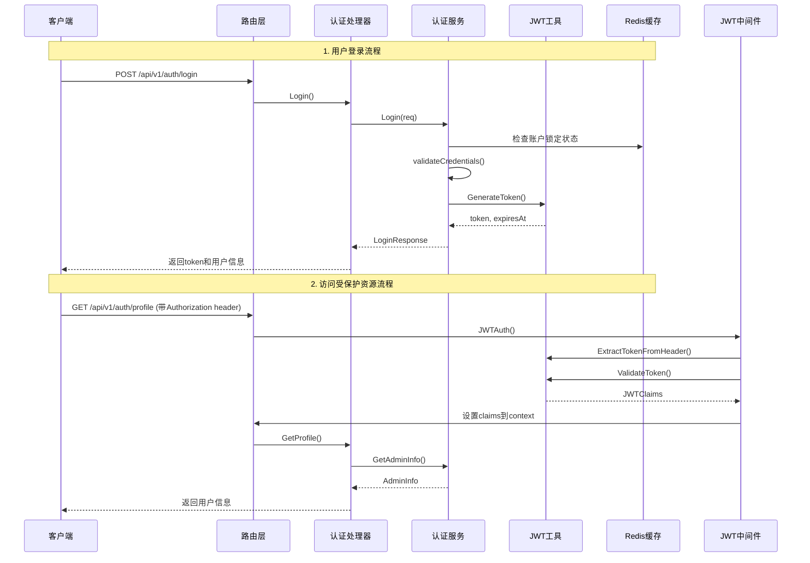

# 学生管理系统 - 用户认证与信息查询流程文档

## 概述

本文档详细描述了学生管理系统中用户从登录到查询用户信息的完整流程，包括涉及的方法、功能模块和数据流转过程。

## 系统架构概览

```
客户端 → 路由层 → 处理器层 → 服务层 → 工具层 → 数据层
```

## 完整流程图



## 详细流程分析

### 1. 用户登录流程

#### 1.1 请求入口

- **路由**: `POST /api/v1/auth/login`
- **处理器**: `AuthHandler.Login()`
- **文件位置**: `/internal/handler/auth_handler.go:35`

#### 1.2 请求验证

```go
// 1. 绑定JSON请求体到LoginRequest结构
var req domain.LoginRequest
if err := c.ShouldBindJSON(&req); err != nil {
    // 返回400错误
}
```

#### 1.3 认证服务处理

**文件位置**: `/internal/service/auth_service.go:29`

##### 1.3.1 安全检查

```go
// 检查账户是否被锁定
lockKey := fmt.Sprintf("login_lock:%s", req.Username)
locked, err := repository.RedisClient.Exists(ctx, lockKey).Result()
```

##### 1.3.2 凭据验证

```go
// 验证用户名和密码
func (s *AuthService) validateCredentials(username, password string) bool {
    defaultUsername := "admin"
    defaultPassword := "123456"
    // 验证逻辑
}
```

##### 1.3.3 失败处理机制

- 记录失败次数到 Redis
- 失败 5 次后锁定账户 5 分钟
- 失败次数过期时间 15 分钟

##### 1.3.4 JWT Token 生成

```go
// 生成JWT token
token, expiresAt, err := utils.GenerateToken(1, req.Username, int64(expiresIn.Seconds()))
```

#### 1.4 JWT Token 生成详细过程

**文件位置**: `/pkg/utils/jwt.go:18`

##### 1.4.1 创建 Claims

```go
claims := domain.JWTClaims{
    AdminID:  adminID,
    Username: username,
    Exp:      expiresAt.Unix(),
    Iat:      now.Unix(),
}
```

##### 1.4.2 编码过程

1. 创建 Header (alg: HS256, typ: JWT)
2. 编码 Header 为 Base64URL
3. 编码 Payload 为 Base64URL
4. 使用 HMAC-SHA256 创建签名
5. 组合最终 token: `header.payload.signature`

#### 1.5 响应结构

```go
response := &domain.LoginResponse{
    Token:     token,
    ExpiresAt: expiresAt,
    Admin: domain.AdminInfo{
        ID:       1,
        Username: req.Username,
    },
}
```

### 2. JWT 认证中间件流程

#### 2.1 中间件入口

**文件位置**: `/pkg/middleware/auth.go:18`

#### 2.2 Token 提取

```go
// 从Authorization header中获取token
authHeader := c.GetHeader("Authorization")
token, err := utils.ExtractTokenFromHeader(authHeader)
```

#### 2.3 Token 验证过程

**文件位置**: `/pkg/utils/jwt.go:67`

##### 2.3.1 格式验证

```go
// 分割token为三部分
parts := strings.Split(tokenString, ".")
if len(parts) != 3 {
    return nil, domain.ErrInvalidToken
}
```

##### 2.3.2 签名验证

```go
// 验证签名
message := headerEncoded + "." + payloadEncoded
expectedSignature := createSignature(message, JWTSecret)
if signatureEncoded != expectedSignature {
    return nil, domain.ErrInvalidToken
}
```

##### 2.3.3 过期时间检查

```go
// 检查token是否过期
if time.Now().Unix() > claims.Exp {
    return nil, domain.ErrTokenExpired
}
```

#### 2.4 上下文设置

```go
// 将claims存储到上下文中
c.Set("claims", claims)
c.Set("admin_id", claims.AdminID)
c.Set("username", claims.Username)
```

### 3. 用户信息查询流程

#### 3.1 请求入口

- **路由**: `GET /api/v1/auth/profile`
- **处理器**: `AuthHandler.GetProfile()`
- **文件位置**: `/internal/handler/auth_handler.go:67`

#### 3.2 获取认证信息

```go
// 从上下文中获取JWT claims（由中间件设置）
claims, exists := c.Get("claims")
if !exists {
    // 返回401未授权错误
}
```

#### 3.3 构建用户信息

```go
// 获取管理员信息
adminInfo := h.authService.GetAdminInfo(jwtClaims)
```

#### 3.4 响应结构

```go
type AdminInfo struct {
    ID       int    `json:"id"`
    Username string `json:"username"`
}
```

## 涉及的核心组件

### 1. 数据结构

#### LoginRequest

```go
type LoginRequest struct {
    Username string `json:"username" validate:"required,min=3,max=50"`
    Password string `json:"password" validate:"required,min=6,max=100"`
}
```

#### JWTClaims

```go
type JWTClaims struct {
    AdminID  int    `json:"admin_id"`
    Username string `json:"username"`
    Exp      int64  `json:"exp"`
    Iat      int64  `json:"iat"`
}
```

#### LoginResponse

```go
type LoginResponse struct {
    Token     string    `json:"token"`
    ExpiresAt time.Time `json:"expires_at"`
    Admin     AdminInfo `json:"admin"`
}
```

### 2. 安全机制

#### 2.1 账户锁定机制

- 连续失败 5 次锁定账户 5 分钟
- 使用 Redis 存储锁定状态和失败次数
- 失败次数 15 分钟后自动清除

#### 2.2 JWT 安全

- 使用 HMAC-SHA256 签名算法
- Token 包含过期时间验证
- 密钥存储在环境变量中

#### 2.3 密码安全

- 使用 SHA256 哈希（演示用，生产环境建议使用 bcrypt）
- 默认管理员账户：admin/123456

### 3. 错误处理

#### 3.1 认证错误类型

```go
var (
    ErrInvalidCredentials = errors.New("invalid credentials")
    ErrTokenExpired      = errors.New("token expired")
    ErrInvalidToken      = errors.New("invalid token")
)
```

#### 3.2 HTTP 状态码映射

- 400: 请求参数错误
- 401: 认证失败/Token 无效
- 500: 服务器内部错误

## 配置参数

### JWT 配置

```yaml
jwt:
  secret: "your-secret-key-change-this-in-production"
  expires_in: "24h"
```

### Redis 配置

```yaml
redis:
  host: "localhost"
  port: 6379
  password: ""
  db: 0
```

## 日志记录

### 关键日志点

1. 登录尝试记录
2. 账户锁定警告
3. Token 生成成功
4. Token 验证失败
5. 认证成功记录

### 日志示例

```json
{
  "level": "info",
  "msg": "Admin login successful",
  "username": "admin",
  "expires_at": "2025-01-16T16:44:26+08:00",
  "time": "2025-01-15T16:44:26+08:00"
}
```

## API 使用示例

### 1. 登录请求

```bash
curl -X POST http://localhost:3060/api/v1/auth/login \
  -H "Content-Type: application/json" \
  -d '{
    "username": "admin",
    "password": "123456"
  }'
```

### 2. 获取用户信息

```bash
curl -X GET http://localhost:3060/api/v1/auth/profile \
  -H "Authorization: Bearer YOUR_JWT_TOKEN"
```

## 性能考虑

### 1. Redis 缓存

- 账户锁定状态缓存
- 登录失败次数缓存
- 减少数据库查询压力

### 2. JWT 无状态

- 服务器无需存储会话状态
- 支持水平扩展
- 减少数据库查询

## 安全建议

### 1. 生产环境优化

- 使用强密钥（至少 32 字节）
- 实现密码复杂度要求
- 使用 bcrypt 等安全哈希算法
- 实现 HTTPS 传输

### 2. 监控告警

- 异常登录尝试监控
- 账户锁定告警
- Token 异常使用检测

## 总结

整个认证流程包含以下关键步骤：

1. **登录验证**: 用户名密码验证 + 安全检查
2. **Token 生成**: JWT token 创建和签名
3. **中间件验证**: 每次请求的 token 验证
4. **用户信息获取**: 基于 token 获取用户信息

系统采用了多层安全机制，包括账户锁定、JWT 签名验证、过期时间检查等，确保了认证过程的安全性和可靠性。
